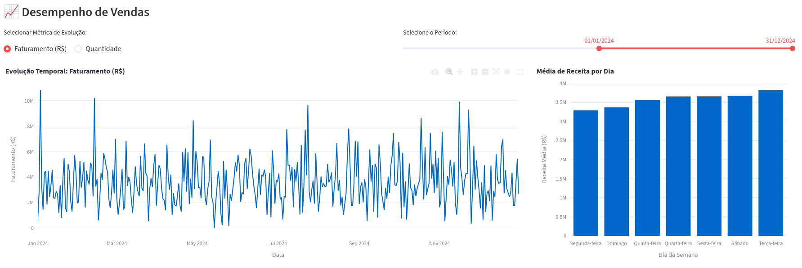
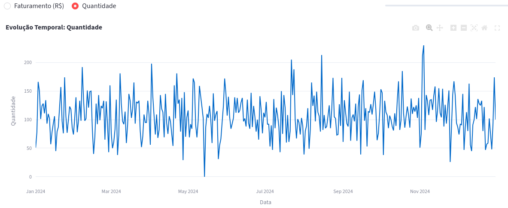
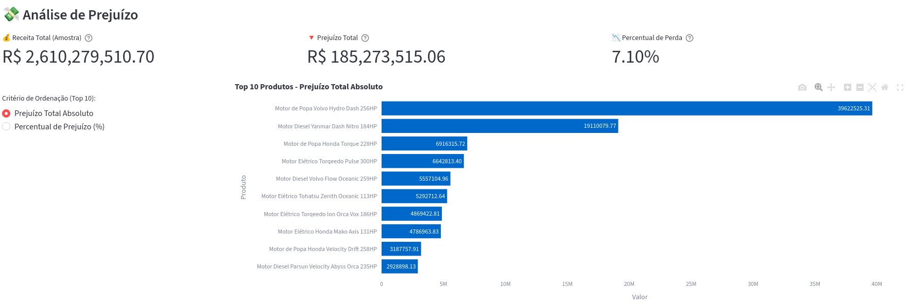
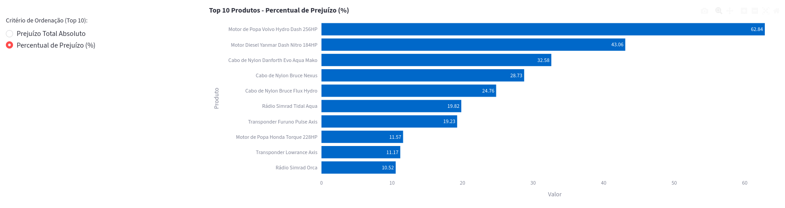
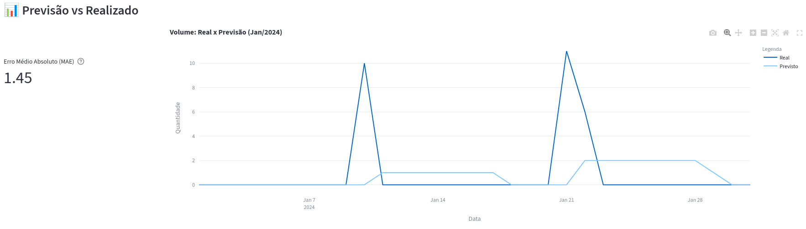
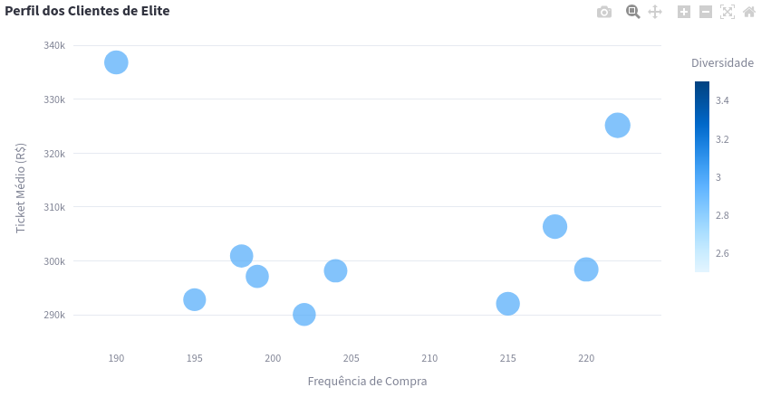
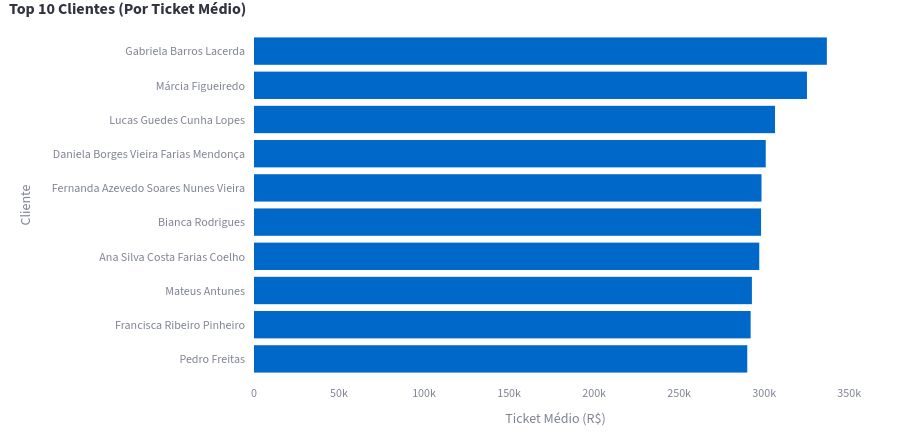
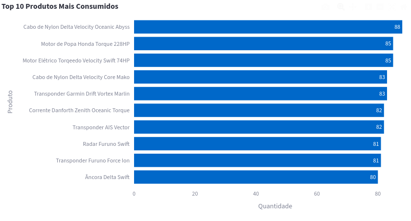
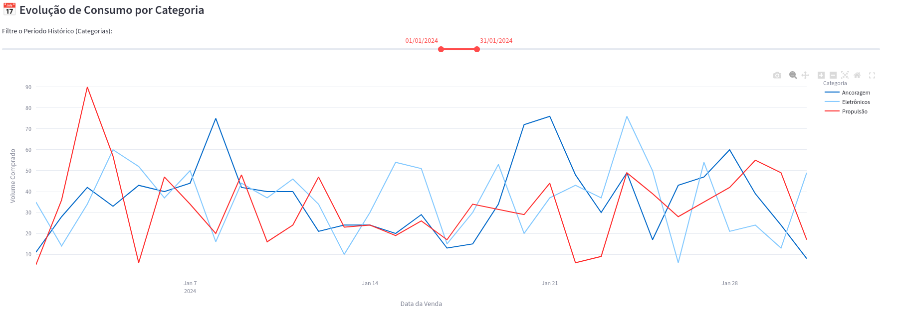

# ✦ Entrega extra - Dashboard 📊📈🔎

Este diretório contém a interface visual do projeto, desenvolvida em Streamlit. O dashboard consolida os resultados das análises de dados, cruzamentos de bases e modelos preditivos em um ambiente interativo para t**omada de decisão de negócios**.

## 🔴 Clique [aqui](https://youtu.be/Vi4QhS4UWQc) para ver o vídeo de apresentação do dashboard

## 🚀 Como Executar o Dashboard

```bash
# garanta que você tenha as dependências instaladas
pip install -r requirements.txt

# navegue para a pasta dashboard
cd dashboard/artefatos/

# inicie o servidor streamlit
streamlit run dashboard.py
```
### ✴︎ URL padrão para interface streamlit: http://localhost:8501/

## 📊 Visualizações

### 📈💰 Desempenho de Vendas e Sazonalidade

Visão temporal interativa do faturamento e volume de vendas, acompanhada da distribuição da receita média por dia da semana para identificação de padrões de consumo.


***Figura 1: Desempenho de vendas por faturamento (R$)***

O gráfico de evolução temporal de faturamento/quantidade pode ser filtrado por um intervalo de data, tendo diversas possibilidades de visiualizações com base nos anos de 2023/2024. A análise temporal de **faturamento em 2024** revela forte **sazonalidade**, com picos de receita concentrados em janeiro, meados do ano e novembro. A divergência entre os picos de receita e volume (quantidade) no mês de janeiro indica a venda de produtos de alto ticket médio neste período específico.

A análise semanal demonstra que as **terças-feiras concentram o maior volume de receita média, superando fins de semana**, o que fornece um direcionamento claro para a alocação de orçamento em campanhas de marketing, além de fornecer uma base para decisões sobre abertura/fechamento da loja.


***Figura 2: Desempenho de vendas por quantidade***

O mesmo gráfico também pode ser visto pela perspectiva de quantidade de vendas, o que pode ajudar a tirar insights sobre picos ou quedas de vendas nos meses dos anos.

Pode-se observar que em janeiro não houve a maior quantidade de produtos vendidos, porém, muitos desses produtos eram de alto valor, por isso a grande receita. Além disso, é possível justificar o faturamento R$ 0,00 no dia 14 de maio, onde nenhum produto foi vendido, o que pode ressaltar em um imprevisto, erro operacional ou erro da base de dados.

### 📉💸 Análise de Prejuízo e Ofensores de Margem

Painel de KPIs financeiros detalhando a receita total, perda absoluta e percentual de perda. Inclui o ranking interativo dos 10 produtos que mais geram impacto negativo no fluxo de caixa.


***Figura 3: Top 10 produtos com maior prejuízo total***

A análise revela um prejuízo absoluto extremamente elevado, que acaba sendo parcialmente mascarado pela alta receita bruta. Isso evidencia que **alto faturamento pode não signficar, necessariamente, lucratividade**.


***Figura 4: Top 10 produtos com maior prejuízo percentual***

O produto que teve a mior perda considerando vendas abaixo do custo de importação é o **Motor de Popa Volvo Hydro Dash 256HP** que também é o com o maior percentual de prejuízo. Comparando os dois gráficos, é interessante observar que esse cenário muda a partir do terceiro produto no ranking, indicando que nem sempre o produto que tem um alto valor de prejuízo total, terá necessariamente uma grande perda considerando a porcentagem de suas vendas.

### 🔮 Previsão de Demanda vs Realizado

Acompanhamento da assertividade do modelo preditivo para janeiro de 2024. O gráfico sobrepõe o volume real com a previsão, acompanhado pela métrica de Erro Médio Absoluto (MAE).


***Figura 5: Real x Previsto modelo baseline***

Apesar da métrica **MAE** mostrar um erro de apenas 1.45 produtos, no gráfico é perceptível que o modelo baseline tem muita dificuldade em **capturar os picos que existem no mês de janeiro e que tende a previsões muito suavizadas**. Como evidencia o gráfico, janeiro vive apenas de 2 picos de vendas durante o mês, sendo o restante dos dias nenhuma quantidade de vendas. Isso dificulta muito a predição do modelo baseline que tem como base a média móvel da quantidade de vendas dos últimos 7 dias referente ao dia analisado. Portanto o modelo média móvel pode funcionar bem para séries estáveis, mas nesse caso não é uma boa alternativa.

### 👥 Perfil de Clientes de Elite  

Mapeamento de clientes baseado em Frequência, Ticket Médio, Faturamento Anual e Diversidade de itens comprados, destacando os maiores compradores da base.


***Figura 6: Scatter plot de identificação do perfil dos clientes***

Nesse gráfico é possível observar pontos bem dispersos, o que indica diferentes perfis de clientes. Como todos eles posueem diversidade igual a 3, não existe variação na coloração dos pontos.

- **Outlier superior esquerdo:** um tipo de cliente que compra com menor frequência, porém possui o grande ticket médio disparado. Ele vai menos à loja, mas quando vai, adquire os itens de maior valor agregado do portfólio de produtos.

- **Outlier superior direito:** seria um tipo de cliente ideal. Aquele que tem uma alta frequência de compra com um grande ticket médio. Provavelmente ele compra bastante produtos diversos.

- **Pontos agrupados no canto inferior:** são clientes que possuem um teto máximo de gastos até aproximadamente 330k com uma frequência moderada/alta de compra.


***Figura 7: Top 10 clientes por ticket médio***


***Figura 8: Top 10 produtos mais consumidos***

### 🛍️ Motor de Recomendação de produtos (Similaridade de Cosseno)

Interface de seleção de produtos que gera dinamicamente um ranking (heatmap) dos 10 itens mais similares ao produto alvo, baseado no comportamento de compra da base de clientes.


***Figura 9: Top 10 produtos mais similares com GPS Garmin Vortex Maré Drift***

A aplicação da Similaridade de Cosseno traduz padrões ocultos de consumo na base de clientes. Os itens listados neste heatmap representam as melhores oportunidades de **itens que podem ser explorados juntos com o GPS Garmin Vortex Maré Drift** em **campanhas estratégicas de marketing**.


### 📦📈 Evolução Histórica por Categoria

Análise temporal expandida demonstrando o volume de vendas estratificado pelas categorias dos produtos, permitindo a filtragem customizada do período.


***Figura 10: Consumo por categoria no mês de janeiro de 2024***
