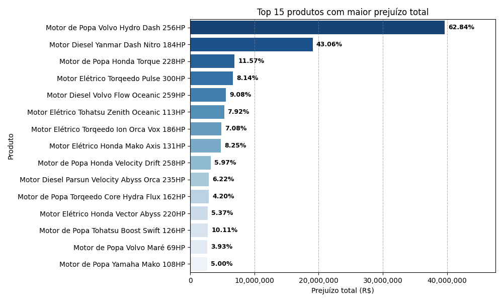

# ✦ Questão 04 - Trabalhando com dados públicos 🗂️🏦

Nessa questão, é necessário identificar produtos que foram vendidos abaixo do custo real, ou seja, que **geraram prejuízo para a LH Nauticals**. Para fazer isso, é necessário cruzar o custo em dólar do dia da venda com o valor da venda em reais e compará-los. Um desafio interessante, foi consultar a **API Olinda do Banco Central** a fim de obter a cotação média de venda do dólar para cada dia que corresponde a uma transação existente na tabela de vendas. No final, foi possível identificar quais produtos mais apresentaram perdas totais e percentuais abrindo a caixa preta financeira da LH Nauticals.

## ⮞ Premissas Obrigatórias

- O custo em USD é unitário
- O custo em BRL deve ser calculado usando o **câmbio da data da venda**
- A taxa de câmbio deve ser considerada a **média da cotação de venda do dia (Banco Central)**
- A **receita total** do produto considera todas as vendas (inclusive as sem prejuízo)
- Ignore impostos e frete

### 🏷️ Cálculo e modelagem 

- **Custo total em BRL por transação**

    Para identificar corretamente o custo em R$ por transação, foi necessário utilizar a **API do Banco Central (Olinda)**, que fornece cotações oficiais de USD para BRL historicamente.

    > https://olinda.bcb.gov.br/olinda/servico/PTAX/versao/v1/odata/CotacaoMoedaDia(moeda=\'USD\',dataCotacao=\'{date}\')

    O Endpoint utilizado, retorna todas as cotações do dólar no dia, referentes a data passada na **URL**. No arquivo [api_requests.py](./artefatos/api_requests.py) é possível visualizar o código utilizado para obter a **média das cotações** de venda do dólar no dia para cada única referente as transações da tabela de vendas.

- **Identifique transações com prejuízo agregando os dados por id_produto, gerando:**
    - Receita total (BRL)
    - Prejuízo total (BRL)
    - Percentual de perda (prejuízo_total / receita_total)

Para as tarefas acima, no arquivo [query.py](./artefatos/query.py) foi construída uma query que possibilita a obtenção de todas essas informações.

### 🏷️ Análise visual

### 🏷️ Análise objetiva 

Responda objetivamente:

#### Qual produto concentra o maior prejuízo absoluto?

De acordo com as análises realizadas, o produto com maior prejuízo é o **Motor de Popa Volvo Hydro Dash 256HP** com `id 72`. Ele acumulou uma perda total absoluta  de **R$ 39.622.525,31** representando **62,84%**. Esse valor representa a quantidade de lucro que a empresa deixou de arrecadar devido a vendas realizadas abaixo do custo de importação convertido na data da transação.

#### O produto com maior prejuízo absoluto também é o que possui a maior porcentagem de perda? (Sim ou Não) 

Sim. 

### 🏷️ Interpretação

#### Qual data de câmbio você utilizou?
Utilizei a cotação média de venda do dólar referente à cada data única referente ao dataset de transações(vendas), conforme exigido pelo enunciado.

O mercado financeiro fecha no final de semana e em dias de feriado, portanto, para garantir que não haja dias sem cotação média, foi propagado a última cotação disponível anteriormente. Dessa forma, cada venda foi associada a uma taxa de câmbio representativa do momento da transação.

Além disso, utilizei `merge_asof` com **direction='backward'** para associar a cada venda o custo unitário mais recente disponível do produto, respeitando o histórico de importações.

#### Como definiu o prejuízo?
O prejuízo foi definido pela diferença entre o custo total convertido (`Preço USD * Taxa de câmbio média * Quantidade`) e o custo total da transação. Portanto, se o custo total for maior que a receita, **há prejuízo**, caso contrário, ele é **considerado 0**, o que torna-o simples de ser filtrado.

#### Alguma suposição relevante? 
É importante observar que em muitos produtos vendidos, há um padrão de **alto volume de vendas**, mas com  **prejuízos absolutos muito elevados**, mesmo tendo um percentual de perda menor. No entanto, se analisarmos o produto com o maior prejuízo, observa-se um cenário simultâneo de **alto prejuízo absoluto e elevado percentual de perda**.

- **Motor de Popa Volvo Hydro Dash 256HP (id 72)**
    - **Receita total:** R$ 63.057.815,65
    - **Prejuízo total:** R$ 39.622.525,31
    - **Percentual de perda:** 62,84%

Isso indica que há algum problema operacional muito grave acontecendo na LH Nauticals, pois não é esperado produtos sejam comercializados tão frequentemente abaixo do custo de importação, indicando **falhas no processo de precificação e erros operacionais**.